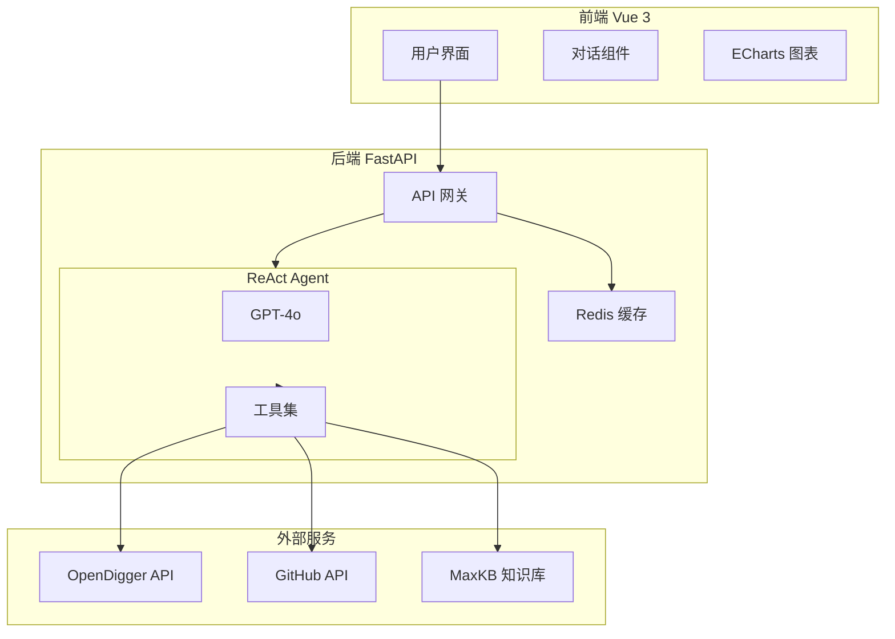

<div align="center">

# 🤖 OpenSource Copilot

**基于 ReAct Agent 架构的开源社区智能运营助手**

<p align="center">
  <a href="#-在线演示">在线演示</a> •
  <a href="#-功能特性">功能特性</a> •
  <a href="#-快速开始">快速开始</a> •
  <a href="#️-系统架构">系统架构</a> •
  <a href="#-技术亮点">技术亮点</a>
</p>

[](https://atomgit.com/x-lab/OpenSODA2025)
[](https://atomgit.com/x-lab/OpenSODA2025)

[](LICENSE)
[](https://python.org)
[](https://vuejs.org)
[](https://github.com/langchain-ai/langgraph)
[](https://fastapi.tiangolo.com)

</div>

---

## 🎬 在线演示

> **🔗 演示地址**: [https://opensource-copilot.vercel.app](https://opensource-copilot.vercel.app)  
> **📺 演示视频**: [Bilibili](https://bilibili.com) | [YouTube](https://youtube.com)

<div align="center">

### 💬 智能对话分析


*一句话完成项目分析，实时展示 Agent 思考过程*

### 📊 项目健康度报告


*多维度评估 + 专业可视化 + AI 改进建议*

### ⚖️ 多项目对比


*横向对比发现最佳实践*

</div>

---

## ✨ 功能特性

<table>
<tr>
<td width="50%">

### 🤖 ReAct Agent 架构

- **自主推理决策** - Agent 能理解问题，决定调用哪些工具
- **透明思考过程** - 实时展示"思考-行动-观察"循环
- **11 个专业工具** - 覆盖分析、诊断、建议全流程
- **多 Agent 协作** - 分析、诊断、建议专业分工

</td>
<td width="50%">

### 📊 多维度健康评估

- **活跃度** - 基于 OpenRank 和 Activity
- **社区健康** - Bus Factor、贡献者分布
- **维护响应** - PR 合并率、Issue 响应时间
- **增长趋势** - 新贡献者、OpenRank 变化

</td>
</tr>
<tr>
<td width="50%">

### 💡 智能洞察建议

- **AI 一句话总结** - 快速了解项目状况
- **问题诊断** - 自动识别潜在风险
- **改进建议** - 可执行的运营策略

</td>
<td width="50%">

### 🎨 专业可视化

- **健康度雷达图** - 四维度直观对比
- **趋势折线图** - 历史数据变化
- **词云图 / 网络图** - 贡献者协作关系
- **桑基图** - 数据流向可视化

</td>
</tr>
<tr>
<td width="50%">

### 🎤 语音交互

- **语音输入** - Web Speech API 支持
- **实时转写** - 语音实时转文字
- **自动发送** - 转写完成自动提交

</td>
<td width="50%">

### 📦 批量分析

- **多项目分析** - 一次分析多个项目
- **预设项目组** - Apache/前端/AI/云原生
- **报告导出** - Markdown/JSON/CSV

</td>
</tr>
<tr>
<td width="50%">

### 🔔 项目监控

- **定时检查** - 持续监控健康度
- **阈值告警** - 自定义告警条件
- **浏览器通知** - 及时推送告警

</td>
<td width="50%">

### 🎨 主题切换

- **深色/浅色** - 双主题支持
- **跟随系统** - 自动适配系统设置
- **粒子动画** - 科技感动态背景

</td>
</tr>
</table>

---

## 🏗️ 系统架构



### Agent 工具链

| 工具 | 功能 | 数据源 |
|------|------|--------|
| `analyze_repo_health` | 全面健康度分析 | OpenDigger |
| `diagnose_repo_issues` | 问题诊断 | OpenDigger |
| `get_improvement_suggestions` | 改进建议 | LLM + 知识库 |
| `get_repo_openrank` | OpenRank 查询 | OpenDigger |
| `get_repo_health_metrics` | 健康指标获取 | OpenDigger |
| `get_repo_contributors_info` | 贡献者分析 | OpenDigger |
| `get_repo_activity_trend` | 活跃度趋势 | OpenDigger |
| `get_github_repo_info` | 仓库信息 | GitHub API |
| `get_github_contributors` | 贡献者列表 | GitHub API |
| `find_good_first_issues` | 新手 Issue | GitHub API |
| `search_opensource_knowledge` | 知识检索 | MaxKB |

---

## 🚀 快速开始

### 方式一：在线体验 (推荐)

直接访问 [https://opensource-copilot.vercel.app](https://opensource-copilot.vercel.app)

### 方式二：Docker 部署

```bash
# 1. 克隆项目
git clone https://github.com/yanchaomei/OpenSODA.git
cd OpenSODA

# 2. 配置环境变量
cp .env.example .env
# 编辑 .env，填入 OPENAI_API_KEY

# 3. 启动服务
docker-compose up -d

# 4. 访问
# 前端: http://localhost:3000
# 后端: http://localhost:8001/docs
```

### 方式三：本地开发

```bash
# 后端
cd backend
python -m venv venv
source venv/bin/activate  # Windows: venv\Scripts\activate
pip install -r requirements.txt
uvicorn main:app --reload --port 8001

# 前端 (新终端)
cd frontend
npm install
npm run dev
```

### 环境变量

```env
# 必需
OPENAI_API_KEY=sk-xxx
OPENAI_MODEL=gpt-4o

# 可选
GITHUB_TOKEN=ghp_xxx       # 提高 GitHub API 限额
REDIS_URL=redis://...      # 启用缓存
```

---

## 🌟 技术亮点

### 1. LangGraph 状态机

```python
# 构建 ReAct 循环
workflow = StateGraph(MessagesState)
workflow.add_node("agent", call_model)
workflow.add_node("tools", ToolNode(tools))
workflow.add_conditional_edges("agent", should_continue)
workflow.add_edge("tools", "agent")  # ReAct 循环
```

### 2. 流式输出思考过程

```python
async for event in graph.astream_events(inputs, version="v2"):
    if event["event"] == "on_tool_start":
        yield {"type": "tool_call", "name": event["name"]}
    elif event["event"] == "on_chat_model_stream":
        yield {"type": "text", "content": chunk.content}
```

### 3. 多维度健康评估算法

```
S_overall = 0.30×S_activity + 0.25×S_community + 0.25×S_maintenance + 0.20×S_growth
```

### 4. 智能缓存系统

- **L1**: 内存 LRU 缓存 (1000 条)
- **L2**: Redis 持久缓存 (30 分钟 TTL)
- **效果**: 重复查询 3s → 50ms

---

## 📸 功能截图

<table>
<tr>
<td></td>
<td></td>
</tr>
<tr>
<td align="center"><b>首页仪表盘</b></td>
<td align="center"><b>智能对话</b></td>
</tr>
<tr>
<td></td>
<td></td>
</tr>
<tr>
<td align="center"><b>项目分析</b></td>
<td align="center"><b>项目对比</b></td>
</tr>
</table>

---

## 📁 项目结构

```
OpenSODA/
├── frontend/                    # Vue 3 前端
│   ├── src/
│   │   ├── components/          # 组件库 (40+)
│   │   │   ├── charts/          # 图表: 雷达/趋势/词云/网络/桑基
│   │   │   ├── chat/            # 聊天: 输入/消息/语音/Agent网络
│   │   │   ├── common/          # 通用: 主题切换/粒子背景/骨架屏
│   │   │   └── layout/          # 布局: 侧边栏/头部
│   │   ├── views/               # 页面视图 (9个)
│   │   │   ├── Home.vue         # 首页
│   │   │   ├── Chat.vue         # 智能对话
│   │   │   ├── Dashboard.vue    # 数据仪表盘
│   │   │   ├── Analysis.vue     # 项目分析
│   │   │   ├── Compare.vue      # 项目对比
│   │   │   ├── BatchAnalysis.vue# 批量分析
│   │   │   ├── Monitor.vue      # 项目监控
│   │   │   ├── History.vue      # 分析历史
│   │   │   └── About.vue        # 关于项目
│   │   ├── stores/              # Pinia 状态
│   │   └── api/                 # API 调用
│   └── vercel.json              # Vercel 部署配置
│
├── backend/                     # FastAPI 后端
│   ├── app/
│   │   ├── agents/              # LangGraph Agent
│   │   │   ├── orchestrator.py  # 主控 Agent (ReAct)
│   │   │   ├── analysis.py      # 分析 Agent
│   │   │   └── diagnosis.py     # 诊断 Agent
│   │   ├── tools/               # Agent 工具 (11个)
│   │   │   ├── opendigger.py    # OpenDigger API
│   │   │   ├── github.py        # GitHub API
│   │   │   └── maxkb.py         # MaxKB 知识库
│   │   ├── api/                 # API 路由
│   │   └── services/            # 业务服务 (缓存/分析)
│   ├── tests/                   # 单元测试
│   └── railway.json             # Railway 部署配置
│
├── docs/                        # 文档
│   ├── API.md                   # API 文档
│   ├── PERFORMANCE_BENCHMARK.md # 性能基准测试
│   ├── DEMO_VIDEO_SCRIPT.md     # 演示视频脚本
│   └── competition/             # 竞赛材料
│       └── PPT_PRESENTATION.md  # PPT 内容
│
├── .github/                     # GitHub 配置
│   ├── ISSUE_TEMPLATE/          # Issue 模板
│   └── PULL_REQUEST_TEMPLATE.md # PR 模板
│
├── CHANGELOG.md                 # 变更日志
├── CODE_OF_CONDUCT.md           # 行为准则
└── docker-compose.yml           # Docker 编排
```

---

## 🔌 开源工具集成

本项目深度集成 OpenSODA 指定的三个开源工具：

| 工具 | 用途 | 集成方式 |
|------|------|----------|
| **[OpenDigger](https://github.com/X-lab2017/open-digger)** | 获取 OpenRank、活跃度等核心指标 | CDN API |
| **[MaxKB](https://github.com/1Panel-dev/MaxKB)** | 开源运营知识库 | Agent 工具 |
| **[DataEase](https://github.com/dataease/dataease)** | 数据可视化 | ECharts 图表 |

---

## 🏆 参赛信息

| 项目 | 内容 |
|------|------|
| **赛项** | "OpenRank杯" 开源数字生态分析与应用创新赛 |
| **赛题** | 赛题三：大模型应用开发 |
| **官网** | https://atomgit.com/x-lab/OpenSODA2025 |

---

## 👨‍💻 开发指南

详见 [CONTRIBUTING.md](CONTRIBUTING.md)

### 添加新工具

```python
from langchain_core.tools import tool

@tool
async def my_new_tool(param: str) -> str:
    """工具描述，Agent 会读取来决定何时使用"""
    return result
```

---

## 📄 许可证

[Apache License 2.0](LICENSE)

---

## 🙏 致谢

- [X-lab](https://github.com/X-lab2017) - OpenDigger
- [1Panel](https://github.com/1Panel-dev) - MaxKB
- [DataEase](https://github.com/dataease) - DataEase
- [LangChain](https://github.com/langchain-ai) - LangGraph

---

<div align="center">

**Made with ❤️ for OpenSODA 2025**

[⬆ 返回顶部](#-opensource-copilot)

</div>
